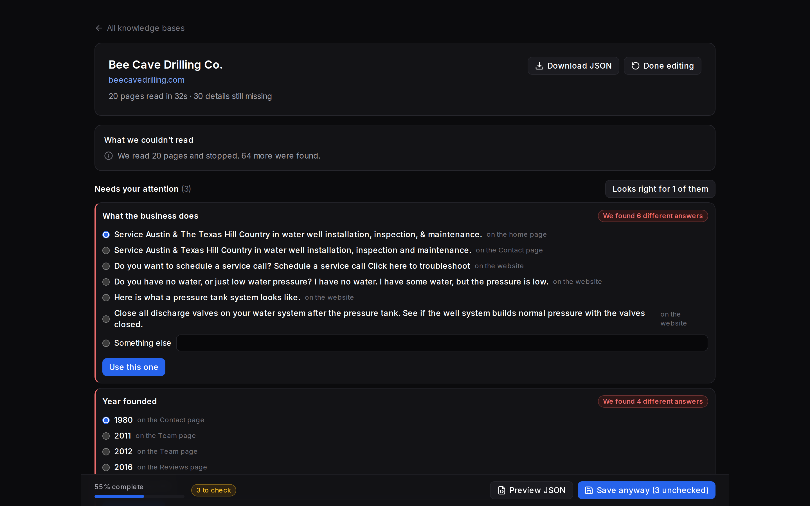
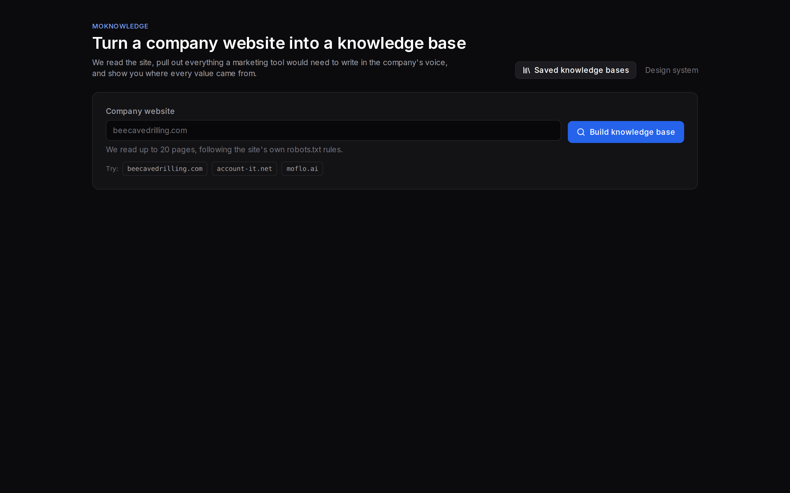
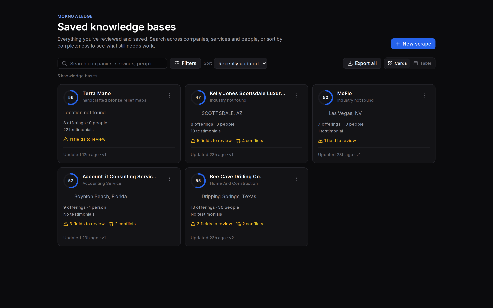
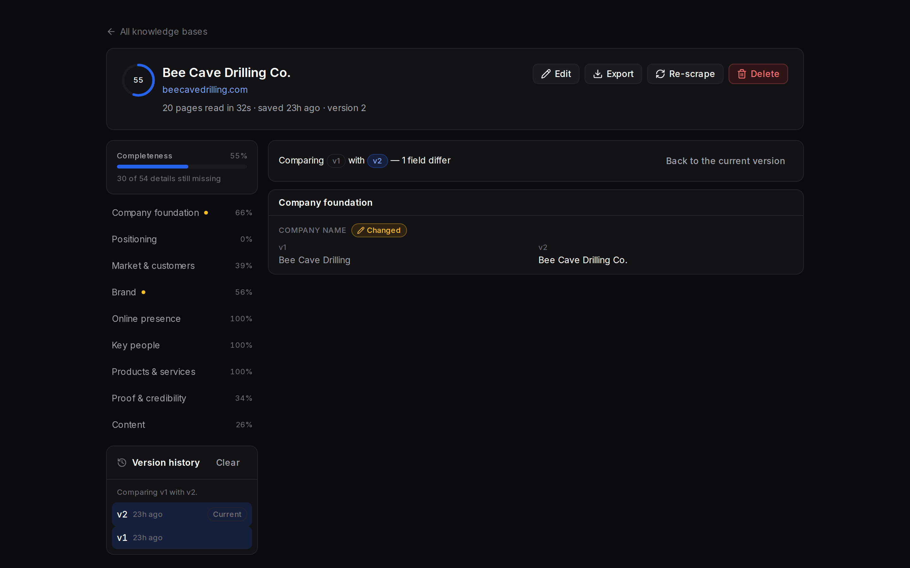

# MoKnowledge

Paste a company's website address. MoKnowledge crawls the site, extracts a structured
knowledge base from the real HTML, shows you exactly where every value came from, lets you
correct what's wrong and answer what's missing, and saves the result as JSON.

Built for the MoFlo SMB Knowledge assignment.



---

## What MoKnowledge does

MoFlo's apps — MoSocial, MoMail, MoBlogs — all write in a company's voice, and all of them are
only as good as the knowledge base behind them. MoKnowledge builds that knowledge base from
the one asset every small business already has: its website.

It does three things a naive scraper does not.

**It never fabricates.** Roughly half of a typical scrape comes back empty, and that is the
normal case — across the eight reference profiles `yearFounded` appears three times and
`revenue` once. A missing field is `{value: null, method: "not-found"}`, rendered as an
explicit "Not found", never an empty string and never a plausible guess.

**It shows its work.** Every value carries how it was obtained, how much it is trusted, and
which pages it came from. Anything a model wrote is badged as such, so a reviewer is never
unsure which they are looking at.

**It asks rather than guesses.** When the site disagrees with itself, both answers survive as a
conflict with the page each came from, resolved in one tap. When something is simply missing,
the app generates up to six plain-language questions ranked by how much the answer would
improve the knowledge base divided by how much work it is to answer.

---

## How to set it up and run it

```bash
npm install
npm run dev          # http://localhost:3000
```

That's it — **no API keys and no external services are required.** Node 20+.

| Script | Purpose |
|---|---|
| `npm run dev` | Development server (Turbopack) |
| `npm run build` | Production build |
| `npm test` | Vitest suite (516 tests) |
| `npm run test:watch` | Vitest in watch mode |
| `npm run lint` | ESLint |
| `npm run typecheck` | `tsc --noEmit` |
| `npm run validate` | Score extraction against the reference profiles |
| `npm run examples` | Rebuild [`examples/`](examples/) (`-- --check` to verify they are current) |
| `npm run snapshot` | Re-capture the HTML fixtures (rarely needed — see below) |
| `npm run ai:check` | One live enrichment call, to verify an API key works |
| `npm run db:migrate` | Apply the Supabase schema and any migrations since (optional — see below) |
| `npm run db:check` | Verify the database behaves as documented |
| `npm run db:parity` | Verify every knowledge base field has a column in `supabase/schema.sql` |
| `npm run db:perf` | Verify the indexes are applicable at a realistic size |
| `npm run db:rebuild` | Rebuild the normalized tables from the stored documents |

### Optional: live AI enrichment

The assignment does not require calling an LLM, so the default path doesn't. Generated fields
use a labelled mock generator and render with an `AI sample` badge.

Set `ANTHROPIC_API_KEY` in `.env.local` and the same four prompts in [`prompts/`](prompts/) run
against a real model instead, badged `AI draft`. Any failure — no key, bad key, timeout,
schema mismatch — falls back to the mock, so a scrape always produces a knowledge base.

| Variable | Default | Purpose |
|---|---|---|
| `ANTHROPIC_API_KEY` | — | Enables live enrichment |
| `ANTHROPIC_MODEL` | `claude-opus-5` | Any model on the account; date-suffixed ids are fine |
| `ANTHROPIC_MAX_TOKENS` | `16000` | Raise if the enrichment report says `truncated` |
| `ANTHROPIC_TIMEOUT_MS` | `30000` | Per-call ceiling, sized so four prompts at one retry each fit inside the scrape route's 300s budget |

The request adapts to the model: adaptive thinking and `output_config.effort` go out only to
4.6-generation models and later, because earlier ones reject both with a 400. Structured
output is used on every model. Because enrichment degrades silently by design,
`npm run ai:check` exists to tell you whether it is actually on.


### Optional: Supabase persistence

The app ships on `LocalJsonAdapter` — that is what "no external services are required"
above means, and it stays the default. [`supabase/schema.sql`](supabase/schema.sql) is the
production design behind the same `StorageAdapter` seam, and the answer to the assignment's
bonus challenge: 43 tables, 25 enum types, 85 RLS policies, multi-company and versioned.
It has been applied to a live Supabase project and verified there, and
[`SupabaseAdapter`](lib/storage/supabase/adapter.ts) runs the app on it when configured.

Every one of the nine knowledge base categories has real tables with real column types —
nothing that the knowledge base standard names is stored only as jsonb. That is enforced
rather than asserted: `npm run db:parity` walks the zod schema in `lib/schema/` and fails
if any field has no column, and `npm run db:check` loads all three committed
`examples/*.json` into the schema to prove real scraped data fits.

| Variable | Purpose |
|---|---|
| `SUPABASE_DB_URL` | Pooler connection string. Either port works — 6543 for the app, 5432 for migrations |
| `NEXT_PUBLIC_SUPABASE_URL` | `https://<project-ref>.supabase.co` |
| `NEXT_PUBLIC_SUPABASE_ANON_KEY` | The anon/publishable key. Public by design — RLS is what protects data |
| `SUPABASE_POOL_MAX` | Connections per process (default 4) |
| `SUPABASE_DB_URL_DIRECT` | The direct endpoint. Nothing reads it — IPv6-only without the IPv4 add-on |

There is no `SUPABASE_ORG_ID`. The tenant comes from whoever is signed in — an
environment variable naming one organization would file every user's work under it
regardless of who they are. Scripts that have no session (`db:rebuild --all`) still accept
one, since they genuinely have no other way to know.

```bash
npm run db:migrate  # apply the schema
npm run db:parity   # 252 checks: every field has a typed column
npm run db:check    # 68 checks: append-only, RLS, signup, cascades, adapter round trip
npm run db:perf     #   9 checks: every design-critical query has an applicable index
```

**Setting `SUPABASE_DB_URL` alone does not switch the app over.** The database URL and the
auth keys are required together: the keys say a person can sign in, the URL says there is
somewhere for their data to go, and one without the other is a misconfiguration rather than
a mode. Half-configured falls back to the local store and says so.

### What turning it on changes

Sign-in appears at `/login`, and everything that touches storage moves behind it. Creating
an account creates a **workspace** — a `security definer` trigger on `auth.users` makes the
new account the owner of a fresh organization — and every knowledge base after that belongs
to it. A second person joins an existing workspace by invitation, matched on the address
they verify; see [`docs/DATABASE.md`](docs/DATABASE.md) §4 for why that is a table and not a
field in the signup form.

Two Supabase project settings matter:

- **Email confirmation** (Authentication → Sign In / Providers → Email). Off means signing
  up returns a session immediately. Leave it on and the app tells people to check their
  inbox, which needs SMTP configured to be usable.
- Nothing else. There is no service-role key anywhere in this app — the anon key is used
  only for authentication, and data access goes over the `pg` pool with the signed-in
  user's id carried into the transaction.

They write inside transactions they roll back, so they leave the database as they found it.
They exist for the same reason `ai:check` does: the guarantees here — append-only versions,
tenant isolation, a lock around concurrent saves — are the kind that look fine when you read
them and are worth executing. Between them they found five real defects in a schema that had
been reviewed and looked right, including an enum missing three of its eight values and a
primary key that would have broken versioning on the second save.
[`docs/DATABASE.md`](docs/DATABASE.md) §2, §3, §7 and §8 describe them.

---

## Key features and functionality

### `/knowledge` — scrape and build



URL input with validation · streaming NDJSON progress while the crawl runs · results organised
by category · a provenance badge and source links on every field · an attention tier that
collects everything worth a second look · conflict resolution · generated gap questions ·
inline editing with eight field editors · add, remove and reorder records · localStorage
autosave with an unsaved-changes guard · JSON preview · save to a new immutable version.

### `/knowledge/view` — library and management



Card, table and detail modes · search across company, offering and people names · filters ·
sort · edit · delete with undo · export one or all · duplicate as a template · version history
with a field-level diff · re-scrape with per-field accept.



More screenshots, including mobile: [`docs/screenshots/`](docs/screenshots/).

---

## Approach to scraping and data extraction

**Extractors propose, a reconciler decides.** No extractor writes a field. Each of the eleven
returns `Evidence[]` — a claim, its path, the method that produced it (`json-ld`, `opengraph`,
`meta`, `dom`, `heuristic`, `computed`), the page and that page's role. Every extractor runs
over every page, and a separate reconciler resolves the pile by source precedence, then by
page role, then by cross-page agreement.

This is the design decision the whole pipeline rests on. A function-per-field scraper breaks on
the second page, when the home page and the contact page disagree and whichever ran last wins.
Here, disagreement is data: it survives as `quality.conflicts` with every candidate and its
origin, and the UI asks.

**Crawl:** robots.txt honoured · sitemap.xml read first, because it is the site's own opinion
of what matters · URLs classified by role · 20-page budget · polite rate limiting · a 2MB
response cap · typed errors, so one dead page costs that page and not the run.

**Extract:** JSON-LD first where it exists, then OpenGraph and meta, then semantic DOM, then
heuristics — with confidence falling at each step. Third-party vendors are fingerprinted from
script and iframe hosts; brand colours and fonts from CSS; text metrics computed in TypeScript.

**Enrich:** four prompts fill what extraction structurally cannot — a company's pitch is not
written on its website in a form you can copy.

**Measured, not asserted.** `npm run validate` scores extraction against the reference profiles
from `Knowledge_Outputs.pdf`, transcribed as golden JSON and run entirely off committed HTML
fixtures — no network, no model, no key. Current recall: `website` 100%, `socials` 86%,
`mainAddress` 80%, `people` 68%, `yearFounded` 67%; 26% overall.

That overall number needs its caveat, in both directions. It measures **agreement with a peer
system, not truth**: in most fields we extract more than the reference does (102 offerings to
its 84, 58 people to 31, 63 social profiles to 14), and producing something the reference
lacks cannot raise the score. Several reference values are known defects we deliberately
disagree with. It is a regression detector, not a grade — see
[`docs/VALIDATION.md`](docs/VALIDATION.md).

The fixtures are captured once and never re-fetched. These are eight real small businesses,
not test targets.

---

## Knowledge base schema design

[`lib/schema/knowledge-base.ts`](lib/schema/knowledge-base.ts) is the single source of truth.
Every type in the app is inferred from it, so runtime validation and compile-time types cannot
drift apart.

**The envelope.** Each scalar is a `Sourced<T>`:

```ts
type Sourced<T> = {
  value: T | null;
  method: "scraped" | "derived" | "ai-live" | "ai-mock" | "user-edited" | "not-found";
  confidence: number;       // 0–1; below 0.5 lands in the review tier
  sourceUrls: string[];
  note?: string;            // conflicts and caveats
};
```

Collections are `Sourced<T[]>` whose items carry their own `RecordProvenance` — a person is
accepted or rejected as a whole card, not field by field.

**Nine categories.** Seven are the assignment's baseline (`foundation`, `positioning`,
`market`, `branding`, `onlinePresence`, `people`, `offerings`). Three go beyond it:

- **`proof`** — testimonials with author and platform, linked to the people and offerings they
  mention; ratings; case studies; certifications; awards; press mentions; trust stats;
  guarantees. A bounded set of *verified* claims, so generated content can cite "40+ years"
  and can never invent a credential.
- **`contentIntelligence`** — themes, posts, taxonomy, cadence, headline patterns, FAQ pairs,
  a glossary of the company's own terms, seasonal signals, content gaps.
- **`quality`** — completeness, missing fields, conflicts, and the ranked follow-up questions.
  Not wrapped in `Sourced<T>`: it is computed *about* the knowledge base rather than extracted
  from the site, so provenance would be meaningless.

All three are justified by defects in the reference outputs, where these signals are already
extracted and then forced into ill-fitting fields — press mentions filed under `Funnels`,
testimonial content paraphrased into person bios with the quotes discarded. Full argument in
[`docs/SCHEMA-EXTENSIONS.md`](docs/SCHEMA-EXTENSIONS.md).

**A second registry.** [`field-meta.ts`](lib/schema/field-meta.ts) carries what the schema
deliberately does not: each field's `impact` (1–5), whether the customer plausibly knows the
answer, the cost of answering, and the plain-language question. That registry is what turns a
schema into a product — it drives the impact-weighted completeness score and the ranked
questions.

**Persistence.** `data/knowledge-bases/{id}/v{n}.json` behind a `StorageAdapter`, so a reviewer
needs no credentials. Every save writes a new immutable version and moves a pointer. The
production Postgres design behind the same interface is in
[`docs/DATABASE.md`](docs/DATABASE.md) and [`supabase/schema.sql`](supabase/schema.sql).

Complete worked examples: [`examples/`](examples/).

---

## Example prompts for AI enrichment

Four real prompts in [`prompts/`](prompts/), each demonstrating a different technique. They are
executable artifacts, not illustrations — the app runs these exact files.

| Prompt | Fills | Technique |
|---|---|---|
| [`01-company-profile`](prompts/01-company-profile.md) | ten fields in one call | Batched generation under hard grounding constraints; `null` framed as *preferable* to a plausible guess |
| [`02-offering-normalization`](prompts/02-offering-normalization.md) | `offerings` | Many-to-one consolidation into a controlled vocabulary, with auditable merge provenance |
| [`03-writing-style`](prompts/03-writing-style.md) | `branding.writingStyle` | A subjective judgement anchored to metrics computed deterministically in TypeScript, so a tone claim cannot contradict the measured text |
| [`04-proof-extraction`](prompts/04-proof-extraction.md) | `proof.testimonials` | Extraction under a machine-verifiable constraint — every quote must be a verbatim substring of the source, checked in code and dropped if not |

Each file carries its purpose, model and parameters, the system prompt, a user template with
`{{placeholders}}`, the JSON Schema output contract, an edge-case table, and design notes.
Conventions in [`prompts/README.md`](prompts/README.md).

---

## Assumptions and limitations

**JavaScript-rendered sites are the real ceiling.** The scraper is `cheerio` over fetched HTML.
A site that renders client-side yields its metadata and little else. This is detected and
reported to the user in plain language rather than failing silently, but it is the single
biggest extraction gap and it would take a headless browser to close.

**Recall is measured against a peer system, not ground truth.** See the caveat above.

**Enrichment degrades silently by design.** Any failure falls back to the labelled mock so a
scrape always yields a knowledge base. That is right in the app and a bad way to discover a
broken key, which is why `npm run ai:check` exists.

**The local store is per-checkout.** `data/knowledge-bases/` is gitignored. A link to a saved
knowledge base will not resolve on someone else's machine.

**Only public websites are fetched.** URLs resolving to loopback, private, link-local or
otherwise reserved addresses are refused — a URL form that fetches server-side is an SSRF
vector, and `169.254.169.254` is a syntactically perfect address. One gap remains:
`redirect: "follow"` hides intermediate hops, so only the first and final URLs are checked.

**`person.gender` is an inference, never a claim.** It exists because the reference outputs
carry it. It ships at low confidence and always lands in the review tier.

**Not built:** authentication, multi-user anything, and `Regenerate` on an individual AI field
(the third "enhance" affordance — it needs a per-field enrichment endpoint).

**`npm audit` reports 3 high-severity advisories** in transitive dependencies of `next@15.5.23`
(`postcss`, `sharp`). The only fix is Next 16, which the assignment's Next.js 15 requirement
rules out. Left unpatched deliberately; neither advisory is reachable from this app's code
paths.

---

## Stack

Next.js 15 (App Router) · TypeScript · Tailwind CSS v4 · React 19 · zod · cheerio · Vitest

## Documentation

| Document | Contents |
|---|---|
| [`ANSWERS.md`](ANSWERS.md) | The five required questions |
| [`extra/ROADMAP.md`](extra/ROADMAP.md) | Requirements traceability, architecture, decisions, phase plan |
| [`docs/SCHEMA-EXTENSIONS.md`](docs/SCHEMA-EXTENSIONS.md) | The beyond-baseline categories and why they exist |
| [`docs/DATA-QUALITY.md`](docs/DATA-QUALITY.md) | Incomplete data; turning gaps into questions |
| [`docs/ENRICHMENT.md`](docs/ENRICHMENT.md) | Where the knowledge gaps are, and how to close them |
| [`docs/DATABASE.md`](docs/DATABASE.md) | Production Postgres design — versioning, projections, RLS |
| [`docs/EDIT-UX.md`](docs/EDIT-UX.md) | The review-and-edit flow |
| [`docs/VIEW-PAGE.md`](docs/VIEW-PAGE.md) | The library and detail views |
| [`docs/VALIDATION.md`](docs/VALIDATION.md) | Golden-set methodology and its caveats |
| [`prompts/`](prompts/) | The four AI enrichment prompts |
| [`examples/`](examples/) | Three complete knowledge bases, as the app produces them |
| [`supabase/schema.sql`](supabase/schema.sql) | The DDL behind `docs/DATABASE.md` |
